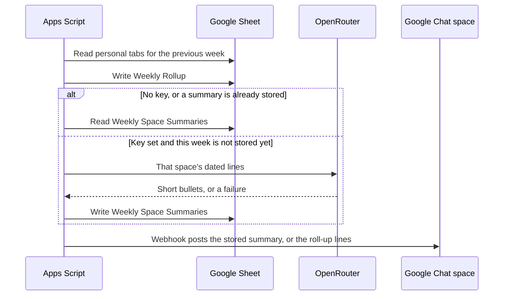
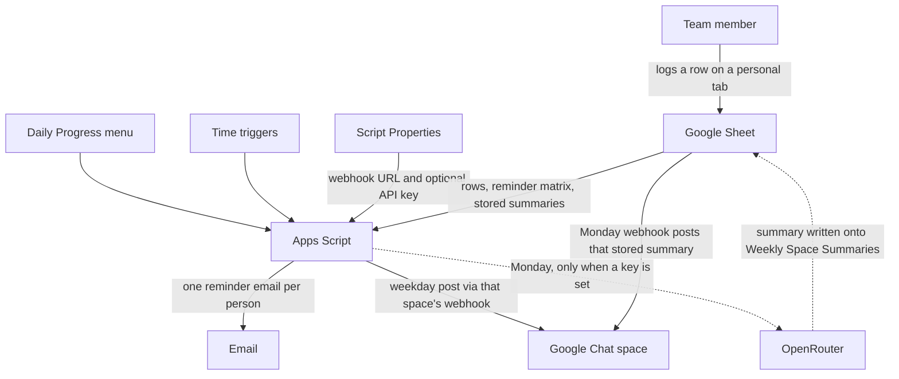

# Daily Progress Logger

Teams that already talk in Google Chat still lose the daily "what did you do?" note. Someone types it in a spreadsheet, someone else pastes a fragment into one space, and a third space never hears about it. By Friday, a recap means scrolling a week of rows and copying them by hand. The link that can post into a space is a secret, so it cannot sit in a cell next to the notes.

This project keeps the notes in one Google Sheet and lets a bound Apps Script carry them into the right Chat spaces. Each person has a tab. Each row names the space that should receive it. On a schedule the script posts that row, reminds anyone who has not written one, and on Monday can collect the previous week. If you choose, it asks OpenRouter for a short summary, writes that summary back onto the sheet, and only then posts it to the matching space through that space's incoming webhook.

What makes that useful:

- The sheet stays the record. Chat receives a copy, not a second place people have to maintain.
- One workbook can feed many spaces. The **Space** column on the row picks the room.
- A reminder names the missing people inside each space, and sends each person one email that lists every space they still owe.
- The weekly summary is optional. The model reply is stored on the sheet first. The Monday webhook posts that stored text. If the key is missing or the call fails, the webhook posts the original lines instead.
- Webhook URLs and the API key live in Apps Script Properties. The sheet stores the property name only.
- There is no Chat API client and no separate Cloud project. An incoming webhook is enough.

This repository is a generic template. Names, emails, space ids, and Chat user ids in the source and in [docs/workbook-sample.md](docs/workbook-sample.md) are fictional. Replace them before you use the script with a real team. Licensed under the [MIT License](LICENSE).

## The workbook

Everything the script reads or writes is a tab in one Google Sheet. [docs/workbook-sample.md](docs/workbook-sample.md) and [docs/workbook-sample.xlsx](docs/workbook-sample.xlsx) show the same fictional rows. `npm install` does not create this sheet. Menu **4** builds the empty tabs on a blank Sheet. The `.xlsx` is there so you can see the filled example, and you can upload it to Drive only if you want those sample rows in your account.

Four tabs describe the team and the clock. People do not log work here.

| Tab | What it holds |
|---|---|
| **Team** | One row per person: name, Slack id (unused while Slack is off), email, Chat mention, and the spaces they belong to. Email is how the script tells two rows apart. The Chat cell is `<users/USER_ID>`, or blank to post the name with no ping. Column E, **Spaces**, is a multi-select list of space names. |
| **Chat Spaces** | One row per room: space name, space id, and the Script Property **name** that holds that room's webhook. The **Configured** checkbox is rewritten from whether that property has a value. The URL itself is never on the sheet. |
| **Reminder Matrix** | One row per person and one checkbox column per space. A checked cell means "remind this person in this space if they have no row for today." |
| **Schedules** | When the four jobs run: reminder, daily post, weekly roll-up, and space access. Days, hour, and minute. The first time this tab is created, space access is marked enabled. Uncheck it unless you want a weekday job that only reapplies Team column E. |

Each person then gets a tab named after them. That is where the day is written.

| Date | Summary | Hours | Blockers | Tomorrow Plan | Space |
|---|---|---|---|---|---|
| 2026-09-23 | Paired on the signup form | 3 | | Write tests | TEAM_ALPHA |

**Space** must match a name in **Chat Spaces**. A blank or unknown space is not posted, and it does not count as done for the reminder.

Two more tabs are filled by the Monday job, not by hand.

| Tab | What it holds |
|---|---|
| **Weekly Rollup** | Previous Monday–Sunday, one row per space and person, with the lines taken from the personal tabs. |
| **Weekly Space Summaries** | The OpenRouter reply for that week and space, when a call returns text. The next run reuses this cell instead of calling the model again. |

## How a week uses those tabs

**During the day.** A person opens their own tab and adds today's date, a short summary, and a **Space**. Hours, blockers, and tomorrow's plan are optional. Nothing is sent at the moment they type. The **Daily Progress** menu can post or remind immediately. Otherwise the **Schedules** tab decides.

**Weekday reminder (default 18:00).** The script reads **Reminder Matrix**, **Team**, and each personal tab. For every checked person who has no summary today in that space, it posts one Chat message into that space. It also sends one email per person, listing every space they still owe. The address comes from **Team**. A person with no email is still named in Chat.

**Weekday post (default 19:00).** The script reads today's rows, groups them by **Space**, and posts one message to each space that has both rows and a webhook. This job does not call OpenRouter.

**Monday roll-up (default 09:00).** The window is the previous Monday through Sunday in the script time zone, even if someone runs the menu on another day. The current, unfinished week is left alone.

1. Personal tabs are collected into **Weekly Rollup**, split by the **Space** on each row.
2. A space with no rows that week is skipped. No model call, and no Chat post.
3. When an OpenRouter key is set and **Weekly Space Summaries** does not already have text for that week and space, the script sends that space's lines to OpenRouter.
4. The reply is written back onto **Weekly Space Summaries**.
5. The script posts to that space's webhook. The message is the stored summary. If there is no stored summary, the message is the member lines from **Weekly Rollup**.



Apps Script may start a job up to about 15 minutes after the minute on **Schedules**. Minutes must be 0, 15, 30, or 45. Editing **Schedules** does not move the clock until menu **14) Apply schedules**.

## How the pieces connect



OpenRouter is not a side door into Chat. The only Chat write is an incoming webhook, and on Monday that webhook carries text that already sits on the workbook: the stored summary, or the roll-up lines when the model did not run. Script Properties hold the webhook URLs and the optional key. The sheet holds property names, not the secret values.

Component notes, the weekday sequence, and the trust boundary: [docs/architecture.md](docs/architecture.md). A standalone picture of the same system: [docs/daily-progress-logger-architecture.html](docs/daily-progress-logger-architecture.html). Why webhooks, Script Properties, and the optional model were chosen: [docs/decisions](docs/decisions/README.md).

## What the published script does today

Version 1.0.0.

| | |
|---|---|
| Runtime | Apps Script V8, bound to one Google Sheet. No separate server. |
| Time zone | `Asia/Kolkata`, set in both `src/appsscript.json` and `TZ` in `src/Code.js`. Change both, or "today" and the trigger hour will disagree. |
| Slack | The code is present. `SLACK_ENABLED` is `false`, so it does not send. |
| Chat API | Not used. Do not add `projectId` to `.clasp.json`, and do not switch the Cloud project in the Apps Script editor. |
| OpenRouter | Off until menu **18** stores a key. Only model ids ending in `:free` are sent. |

## About

Operators install the script with [clasp](https://github.com/google/clasp), store each webhook in Script Properties, and use the **Daily Progress** menu. Contributors change message and date rules in `src/logic.js`, where `npm test` can see them, and leave spreadsheet and network calls in `src/Code.js`.

The project is maintained by [Jayaram Nambiar](https://github.com/Jayaram-Nambiar). Questions and fixes go through [GitHub issues](https://github.com/Jayaram-Nambiar/daily-progress-logger/issues). Vulnerability reports go through [SECURITY.md](SECURITY.md).

## Repository layout

| Path | Role |
|---|---|
| `src/Code.js` | Menu, sheets, webhooks, triggers, OpenRouter fetch |
| `src/logic.js` | Pure helpers covered by `npm test` |
| `src/appsscript.json` | V8 runtime, time zone, OAuth scopes |
| `test/logic.test.js` | Node tests |
| `docs/runbook.md` | Setup and day-to-day steps, with the reason and the pitfalls for each |
| `docs/architecture.md` | Components, sequences, and trust boundary |
| `docs/workbook-sample.md` | Fictional workbook, as tables |
| `docs/workbook-sample.xlsx` | The same fictional workbook, as a file |
| `docs/decisions/` | Architecture decision records |

## Run it locally

```powershell
npm install
npm test
node --check src/Code.js
node --check src/logic.js
copy .clasp.json.example .clasp.json
```

Set `scriptId` in `.clasp.json`. Leave `projectId` out.

```json
{
  "scriptId": "YOUR_APPS_SCRIPT_ID",
  "rootDir": "src"
}
```

```powershell
npm run push
```

`.clasp.json` is gitignored because it holds your script id. `npm run pull` and `npm run push` do not change Script Properties, triggers, or sheet cells.

The install order, and what fails if a step is skipped: [docs/runbook.md](docs/runbook.md).

## Point it at a real team

1. Bind the script to your spreadsheet and push `src/`.
2. Replace `EXAMPLE_ROSTER`, `EXAMPLE_SPACE_ROWS`, and `EXAMPLE_CHAT_USER_IDS` in `src/Code.js`, then push again. Keep webhook URLs out of the source file. Provisioning the published examples inserts the fictional people into the sheet.

```javascript
const EXAMPLE_ROSTER = [
  ['Alex Rivera', 'alex.rivera@example.com']
];
```

3. Store each space's incoming webhook in Script Properties. Menu **5** writes only `GOOGLE_CHAT_WEBHOOK_URL` (the example primary space `TEAM_ALPHA`). Other spaces use the property name in **Chat Spaces** column C.
4. On Team cell E2, create a multi-select dropdown from `Chat Spaces!A2:A` in the Sheets UI. Apps Script cannot create that chip control. Then run menu **16**.
5. Uncheck **Space access** on the Schedules sheet and run menu **14) Apply schedules**.
6. Optional weekly summaries: menu **18) Set OpenRouter API key**. Defaults: `meta-llama/llama-3.3-70b-instruct:free`, then `deepseek/deepseek-v4-flash:free`. Set Script Property `OPENROUTER_ENABLED` to `0` to skip the model without deleting the key. Clear the **Weekly Space Summaries** row for that week and space if you want a fresh reply. The next Monday post reads whatever is stored there.

## Secrets

Never commit webhook URLs, API keys, `.clasprc.json`, or `.clasp.json`. Never put a real roster into the example constants. The sheet stores Script Property names, not secret values. A weekly summary also sends that week's lines, and the spreadsheet URL, to OpenRouter. Leave the key unset to keep the text inside Google. Details: [SECURITY.md](SECURITY.md).

## Contributing

[CONTRIBUTING.md](CONTRIBUTING.md) · [Code of Conduct](CODE_OF_CONDUCT.md) · [Security](SECURITY.md)

## License and attribution

[MIT License](LICENSE). Copyright (c) 2026 Jayaram Nambiar.

Third-party notices are in [NOTICE](NOTICE). In short: `@google/clasp` is an Apache-2.0 development dependency and is not vendored here; the HTML architecture diagram is adapted from the Hermes Agent architecture-diagram skill (MIT; Cocoon AI); the code of conduct is adapted from Contributor Covenant 2.1 (CC BY 4.0).
