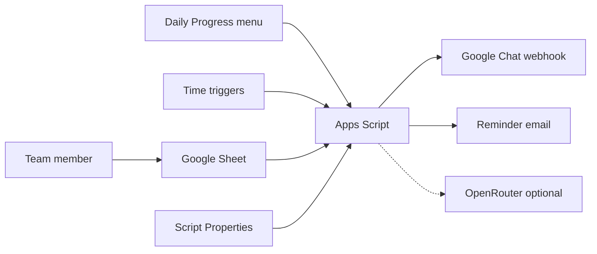
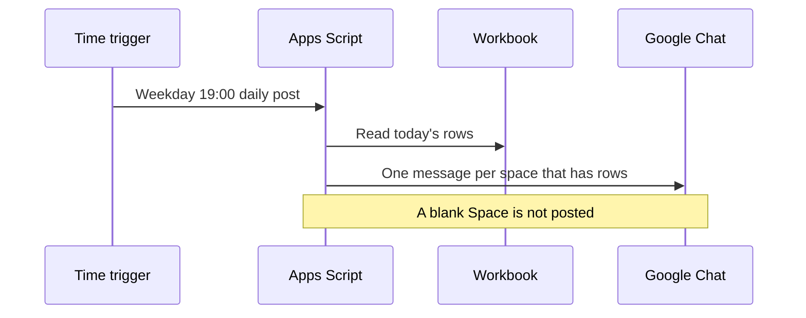

# Daily Progress Logger

Spreadsheet-bound [Apps Script](https://developers.google.com/apps-script) template. Each person logs a daily row on their own tab. The script posts that row to a Google Chat space through an incoming webhook, reminds people who have not logged, and can post a Monday summary of the previous week.

This repository is a generic template. Names, emails, space ids, and Chat user ids in the source and in [docs/workbook-sample.md](docs/workbook-sample.md) are fictional. Replace them before you use the script with a real team. Licensed under the [MIT License](LICENSE).

## Current application

Version 1.0.0, as published in this repository.

| | |
|---|---|
| Runtime | Apps Script V8, bound to one Google Sheet. No separate server. |
| Time zone | `Asia/Kolkata`, set in both `src/appsscript.json` and `TZ` in `src/Code.js`. |
| Weekday reminder | 18:00. One Chat message per space, and one email per person listing every space they still owe. |
| Weekday post | 19:00. Today's rows, split by the **Space** column. |
| Monday roll-up | 09:00. Previous Monday–Sunday. Summary-only Chat post when an OpenRouter key is set; otherwise the member text. |
| Slack | Code is present. `SLACK_ENABLED` is `false`, so it does not send. |
| Chat API | Not used. The script stays on Apps Script's default Cloud project. |

Times come from the **Schedules** sheet. The first install marks **Space access** enabled; uncheck it unless you want a weekday job that only reapplies Team column E. Apps Script may start a job up to about 15 minutes after the minute you set.

## About

Daily Progress Logger keeps a team’s daily notes in a spreadsheet the team already has, and mirrors the notes into the Chat spaces where the work is discussed. Operators install it with [clasp](https://github.com/google/clasp), store webhook URLs in Script Properties, and run the **Daily Progress** menu. Contributors extend `src/logic.js` under `npm test` and keep side effects in `src/Code.js`.

The project is maintained by [Jayaram Nambiar](https://github.com/Jayaram-Nambiar). Questions and fixes go through [GitHub issues](https://github.com/Jayaram-Nambiar/daily-progress-logger/issues). Vulnerability reports go through [SECURITY.md](SECURITY.md).

## Architecture



The workbook is the system of record. Script Properties hold webhook URLs and the optional API key. The sheet stores property names, not the secret values. The dashed arrow is the only path that sends progress text outside Google.



Full component notes, the weekly sequence, and the trust boundary: [docs/architecture.md](docs/architecture.md). The same layout as a standalone diagram: [docs/daily-progress-logger-architecture.html](docs/daily-progress-logger-architecture.html). Why webhooks, Script Properties, and the optional model were chosen: [docs/decisions](docs/decisions/README.md).

## Repository layout

| Path | Role |
|---|---|
| `src/Code.js` | Menu, sheets, webhooks, triggers, OpenRouter fetch |
| `src/logic.js` | Pure helpers covered by `npm test` |
| `src/appsscript.json` | V8 runtime, time zone, OAuth scopes |
| `test/logic.test.js` | Node tests |
| `docs/runbook.md` | Setup and day-to-day steps, with the reason and the pitfalls for each |
| `docs/architecture.md` | Components, sequences, and trust boundary |
| `docs/workbook-sample.md` | Fictional workbook |
| `docs/decisions/` | Architecture decision records |

## Local commands

```powershell
npm install
npm test
node --check src/Code.js
node --check src/logic.js
copy .clasp.json.example .clasp.json
```

Set `scriptId` in `.clasp.json`. Leave `projectId` out.

```json
{
  "scriptId": "YOUR_APPS_SCRIPT_ID",
  "rootDir": "src"
}
```

```powershell
npm run push
```

`.clasp.json` is gitignored because it holds your script id. `npm run pull` and `npm run push` do not change Script Properties, triggers, or sheet cells.

Step-by-step install, including why each constraint exists: [docs/runbook.md](docs/runbook.md).

## Configure a deployment

1. Bind the script to your spreadsheet and push `src/`.
2. Replace `EXAMPLE_ROSTER`, `EXAMPLE_SPACE_ROWS`, and `EXAMPLE_CHAT_USER_IDS` in `src/Code.js`, then push again. Keep webhook URLs out of the source file.

```javascript
const EXAMPLE_ROSTER = [
  ['Alex Rivera', 'alex.rivera@example.com']
];
```

3. Store each space's incoming webhook in Script Properties. Menu **5** writes only `GOOGLE_CHAT_WEBHOOK_URL` (the example primary space `TEAM_ALPHA`). Other spaces use the property name in **Chat Spaces** column C.
4. On Team cell E2, create a multi-select dropdown from `Chat Spaces!A2:A` in the Sheets UI. Apps Script cannot create that chip control. Then run menu **16**.
5. Uncheck **Space access** on the Schedules sheet and run menu **14) Apply schedules**.
6. Optional weekly summaries: menu **18) Set OpenRouter API key**. Only model ids ending in `:free` are used. Defaults: `meta-llama/llama-3.3-70b-instruct:free`, then `deepseek/deepseek-v4-flash:free`. Set Script Property `OPENROUTER_ENABLED` to `0` to skip the model without deleting the key.

## Secrets

Never commit webhook URLs, API keys, `.clasprc.json`, or `.clasp.json`. Never put a real roster into the example constants. The sheet stores Script Property names, not secret values. Details: [SECURITY.md](SECURITY.md).

## Contributing

[CONTRIBUTING.md](CONTRIBUTING.md) · [Code of Conduct](CODE_OF_CONDUCT.md) · [Security](SECURITY.md)

## License and attribution

[MIT License](LICENSE). Copyright (c) 2026 Jayaram Nambiar.

Third-party notices are in [NOTICE](NOTICE). In short: `@google/clasp` is an Apache-2.0 development dependency and is not vendored here; the HTML architecture diagram is adapted from the Hermes Agent architecture-diagram skill (MIT; Cocoon AI); the code of conduct is adapted from Contributor Covenant 2.1 (CC BY 4.0).
