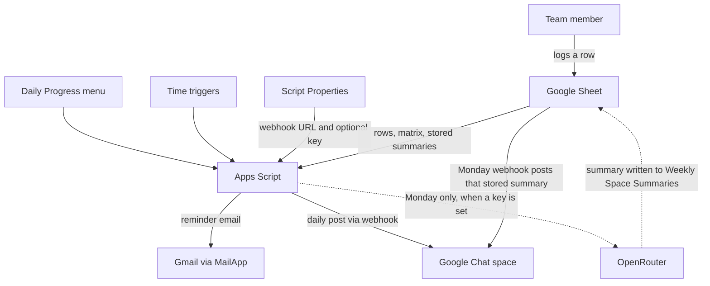
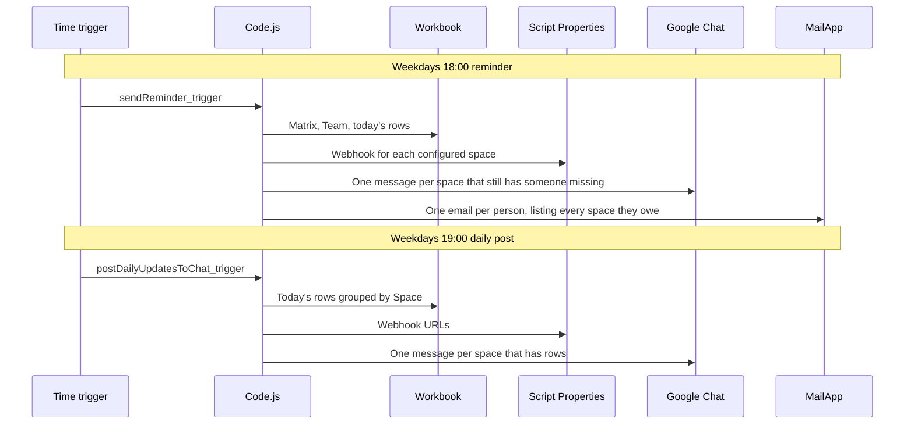
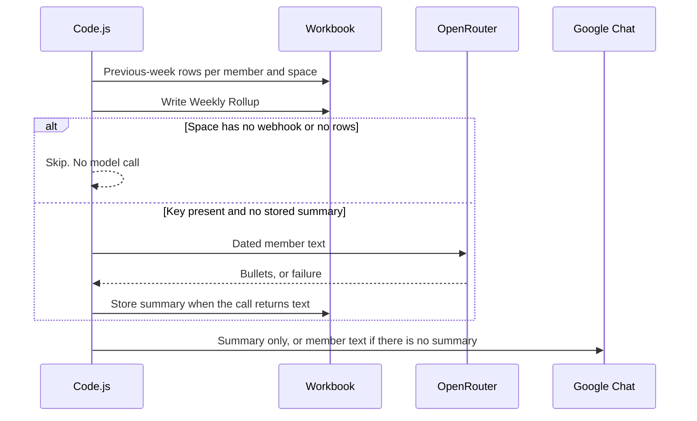
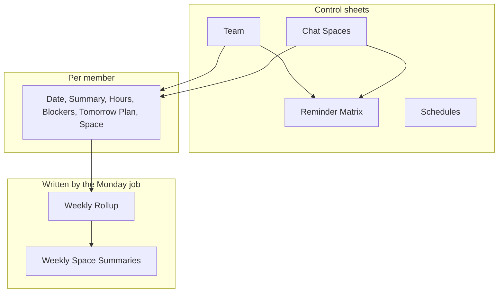
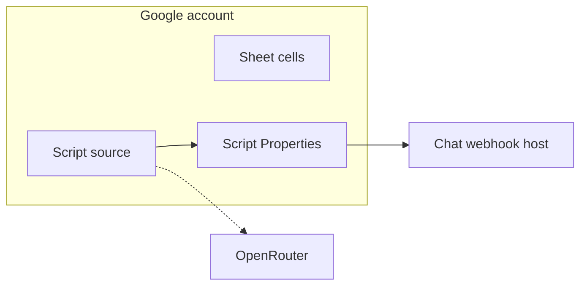

# Architecture

Daily Progress Logger is a spreadsheet-bound Apps Script template. The workbook is the system of record. Apps Script reads it on a schedule, reads secrets from Script Properties, and posts plain text to Google Chat incoming webhooks. There is no separate server and no Google Chat API client.

A standalone diagram of the same layout is in [daily-progress-logger-architecture.html](daily-progress-logger-architecture.html). Decisions are in [decisions/](decisions/README.md).

## Current shape

Version 1.0.0. Time zone `Asia/Kolkata` (`TZ` in `src/Code.js` and `timeZone` in `src/appsscript.json`). Slack posting is compiled in and switched off (`SLACK_ENABLED = false`). Weekly summaries call OpenRouter only when an API key is stored and `OPENROUTER_ENABLED` is not `0`.

## System context

OpenRouter is not a destination. On Monday the script may send one space's previous-week text out, write the reply onto **Weekly Space Summaries**, and only then post that stored text through the space's incoming webhook. If the key is unset or the call fails, the webhook posts the member lines already saved on **Weekly Rollup**. The dashed arrows are the only path that sends progress text outside Google.

## Components

| Piece | Where | Role |
|---|---|---|
| Workbook | Bound Google Sheet | Team roster, spaces, reminder matrix, schedules, one tab per member, weekly tables |
| Menu and triggers | `src/Code.js` | UI actions and clock jobs. Owns every Apps Script side effect |
| Rules | `src/logic.js` | Dates, schedule checks, reminder text, weekly prompt. No I/O |
| Secrets | Script Properties | Webhook URLs and the optional API key. Names, not values, appear on the sheet |
| Chat | Incoming webhook URL | One HTTPS POST per space. Not the Chat API |
| Mail | `MailApp` | One reminder email per person who still owes a row |
| OpenRouter | `https://openrouter.ai/api/v1/chat/completions` | Optional Monday summary. Free-tier model ids only |

OAuth scopes in `src/appsscript.json` match those jobs: current spreadsheet, send mail, external request, and manage triggers. The script does not request the Chat API.

## Weekday flow

Defaults assume the Schedules sheet has not been edited. Apps Script may start a job up to about 15 minutes after the chosen minute. Minutes must be 0, 15, 30, or 45.

A row with a blank or unknown **Space** is not posted and does not count as today's update for a reminder.

Monday 09:00 runs the weekly roll-up for the previous Monday–Sunday in the script time zone, including when someone runs menu 9 on another day. The current partial week is not the roll-up window.

## Workbook

| Sheet | Columns | Who writes the body |
|---|---|---|
| Team | Name, Slack, Email, Chat, Spaces | Operator. Email is the identity key. Chat is `<users/USER_ID>` or blank |
| Chat Spaces | Space, Space id, Webhook property, Configured | Operator sets A–C. Column D is rewritten from Script Properties |
| Reminder Matrix | Member, then one checkbox per space | Menu 10 rebuilds columns and keeps checks. Menu 16 clears checks for spaces the person is not in |
| Schedules | Job, Enabled, Days, Hour, Minute | Menu 14 installs triggers from this sheet |
| Personal tab | Member headers above | The member |
| Weekly Rollup | Week Start, Week End, Space, Member, Weekly Summary | Monday job |
| Weekly Space Summaries | Week Start, Week End, Space, LLM Summary | Monday job, when a model returns text |

Fictional rows that match these headers are in [workbook-sample.md](workbook-sample.md). Those names, emails, and ids are examples, not a real team.

## Trust boundary

- Sheet editors see progress text and Script Property **names**. They do not see webhook URLs unless they can also open the script project.
- Script editors can read Script Properties. Treat that access as access to the webhooks and the API key.
- `clasp push` uploads `src/`. It does not upload Script Properties, triggers, or cell values.
- OpenRouter receives the weekly prompt and the spreadsheet URL as `HTTP-Referer`. Leave the key unset to keep that text inside Google.

## What the clock does not do

- It does not read Chat membership. `writeMemberSpaceColumn_` is unused. Column E is the membership list.
- It does not post to Slack while `SLACK_ENABLED` is false. The weekend check in the Slack path does not apply to Chat jobs. Chat jobs follow the days on the Schedules sheet.
- It does not install triggers when someone edits the Schedules sheet. Menu **Apply schedules from sheet** deletes and recreates the operational triggers.
- The first time the Schedules sheet is created, **Space access** is inserted as enabled. That job only reapplies column E. Uncheck it and apply schedules unless that reapply is wanted.

## Code map

`src/Code.js` is grouped in this order: menu, roster provision, schedules, space column, daily post, Slack (disabled), reminders, weekly roll-up, OpenRouter, sheet helpers.

`src/logic.js` exports one `Logic` object. Apps Script loads it as a project file, so `Code.js` calls `Logic` with no `require`. Tests load the same file in a `vm` sandbox.
